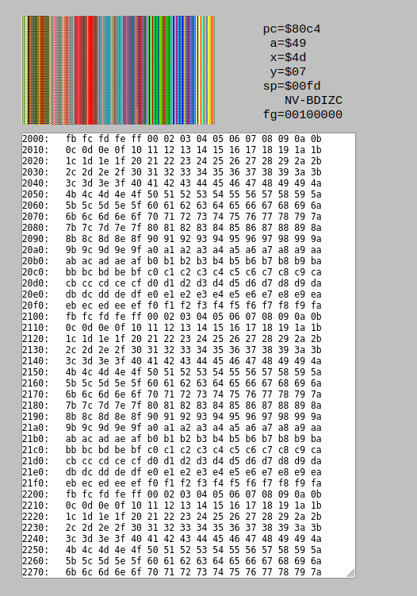

# BoundText Project

6502 powered eReader for developing markets

- https://www.youtube.com/watch?v=PxZGoiWvA4A
- http://6502.org/tutorials/6502opcodes.html
- https://cc65.github.io/

## Getting started

While I am working on the dev environment, `make 6502js` will start a javascript version similar to the simulator we're building, but using only javascript.

## Notes
- $ is base 16
